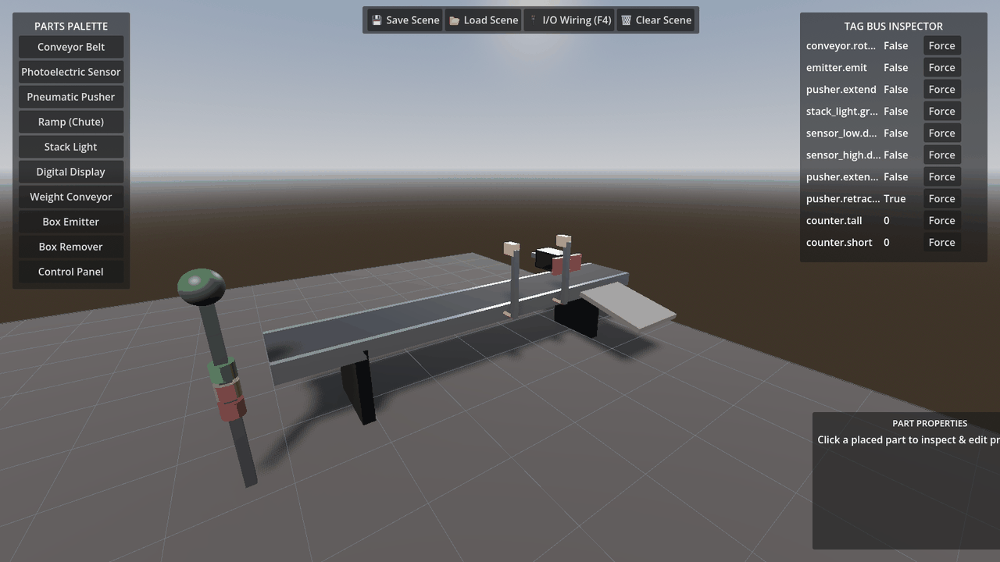

# FactoryForge 🏭

[](https://godotengine.org/)
[](https://www.python.org/)

[](tests/)
[](examples/tia/)
[](LICENSE)

*A free, open 3D factory simulator for learning PLC programming — a modern, customizable open replacement for Factory I/O.*

**Author & Creator:** Mahamed Algaroshy (محمد الجروشي)  
**Repository:** [github.com/malgaroshy-maker/factory](https://github.com/malgaroshy-maker/factory)

---

## 🌟 Overview

**FactoryForge** allows students, automation engineers, and software developers to write PLC logic (Ladder Diagram, SCL, Function Block Diagram) in TIA Portal, OpenPLC, Node-RED, or Ignition SCADA, and watch it drive a real-time 3D physics-based factory in Godot 4.7.

No accounts, no per-seat subscription fees, and 100% open for custom part & driver creation.



```
┌────────────────────────────┐          ┌──────────────────────────┐
│  SIM ENGINE (Godot 4.7/C#) │          │  DRIVER SIDECAR (Python) │
│                            │          │                          │
│  3D render + Jolt physics  │  tag bus │  asyncua      (OPC UA)   │
│  scene editor / voxel grid │ ◄──────► │  pythonnet    (PLCSIM)   │
│  11-part library           │    WS    │  python-snap7 (S7)       │
│  tag registry (authority)  │   JSON   │  built-in     (Modbus)   │
└────────────────────────────┘          └──────────────────────────┘
```

---

## ✨ Key Features

* 🎚️ **Analog I/O**: Float tags end to end — a modulating valve and a level transmitter, so you can write a real PID against a nonlinear process rather than only on/off logic.
* ⏯️ **Run / Pause / Reset & time scale (0.25×–4×)**: freeze the line mid-cycle to read every sensor and actuator at that instant, or slow a fast sequence down to watch an interlock. The PLC stays connected while paused.
* 🎮 **Godot 4.7 C# 3D Engine & Jolt Physics**: 60 FPS 3D rendering with soft shadows, SSAO, metallic shaders, and continuous collision detection.
* 📦 **Real rigid-body cartons**: mass from carton density, friction tuned per material pair (rubber belt, cardboard, steel chute), boxes that accumulate behind a blocked diverter instead of passing through it.
* 🛠️ **3D Scene Editor Suite**: Interactive voxel grid snapping, rotation (**`R`**), drag move (**`M`**), selection wireframe gizmo, and **`Ctrl+Z`** / **`Ctrl+Y`** undo/redo.
* 🔌 **Visual I/O Driver Wiring Panel (`F4`)**: Centered split-screen modal allowing users to drag/click PLC addresses (`%I0.0`, `%Q0.0`) directly to factory component tags.
* 🏷️ **Live In-Scene Tag Inspection & Floating 3D Badges**: Floating 3D billboard labels above components with interactive live forcing buttons.
* 🏭 **Native Siemens Integration**: Supports Siemens PLCSIM Advanced Simulation Runtime API (shared memory, zero network latency, no OPC UA licence needed) and Snap7 ISO-on-TCP.
* 📊 **Multi-Protocol SCADA Support**: Built-in OPC UA client/server, Modbus TCP server, and Node-RED integration.

---

## 📦 11-Part Industrial Component Library

| Component | Description | Tag Bus Interface |
|---|---|---|
| **Conveyor Belt** | Surface-velocity belt with side rails and legs | `conveyor.rotate` (Bit, Output) |
| **Photoelectric Sensor** | Optic lens RayCast3D beam sensor | `sensor.detect` (Bit, Input) |
| **Pneumatic Pusher** | Cylinder housing, chrome shaft & orange face plate | `pusher.extend`, `pusher.extended`, `pusher.retracted` |
| **Inclined Ramp (Chute)** | 30° gravity chute with guide rails; incline and friction are a matched pair so cartons actually slide | Physical static body |
| **Stack Light** | 3-stage industrial tower light (Green, Yellow, Red) | `stacklight.green`, `yellow`, `red` |
| **Digital Display** | 3D 7-segment LED panel displaying live integer counts | `display.value` (Int, Output) |
| **Weight Scale Conveyor**| Integrated load cell scale returning box mass | `weighconveyor.weight` (Int, Input) |
| **Box Emitter** | Spawner emitting tall & short physics rigid boxes | `emitter.emit` (Bit, Output) |
| **Box Remover** | Area3D zone despawning items & incrementing counters | `counter.tall`, `counter.short` (Int, Input) |
| **Control Panel** | Industrial operator station with push buttons & lamps | `panel.green`, `panel.red` |
| **Level Tank** | Analog process tank; outflow follows Torricelli, so process gain varies with level and a PID tuned full overshoots when empty | `tank.fill`, `tank.drain` (Float, Output), `tank.level` (Float, Input) |

---

## ⚡ Quick Start

### 1. Installation

```bash
git clone https://github.com/malgaroshy-maker/factory.git
cd factory
pip install -e "sidecar[dev,opcua]"
```

### 2. Run Test Suite (41 Tests)

```bash
python -m pytest -q
```

### 3. Launch 3D Simulation Engine

```bash
cd engine
dotnet build
"<GODOT_CONSOLE_EXE>" --path .
```

This runs the **physics scene**: Jolt rigid-body cartons, real collisions, and
components whose properties genuinely change how the line behaves — speed up the
belt and boxes outrun the diverter; hold the pusher out and the line backs up
behind it.

```bash
# Fixed-timestep scene instead: reproducible, and the regression contract.
"<GODOT_CONSOLE_EXE>" --path . -- --deterministic
```

Both scenes expose the **same ten tags** and report the same scene name, so a PLC
program, Node-RED flow or SCADA client drives either one unchanged. Use
`--deterministic` whenever you need repeatable counts — CI and
`tools/drive_engine.py` rely on it.

---

## 🔌 Driver Execution Commands

Launch the sidecar with any driver target:

```bash
# Siemens PLCSIM Advanced (Shared Memory API — Zero Licence Cost)
python -m factoryforge_sidecar demo --driver plcsim-advanced

# Siemens S7 ISO-on-TCP (Snap7)
python -m factoryforge_sidecar demo --driver s7-snap7

# OPC UA Client (Connecting to S7-1500 @ 192.168.1.20)
python -m factoryforge_sidecar demo --driver opcua-client -o url opc.tcp://192.168.1.20:4840

# OPC UA Server (Exposing scene to Node-RED / SCADA)
python -m factoryforge_sidecar demo --driver opcua-server
```

---

## 📚 Documentation Sitemap

| Document | Description |
|---|---|
| 🚀 **[GETTING_STARTED.md](docs/GETTING_STARTED.md)** | Step-by-step setup for PLCSIM Advanced, TIA Portal & Node-RED |
| 🛠️ **[PART_AUTHORING.md](docs/PART_AUTHORING.md)** | Guide & template for building custom 3D factory components |
| 🔌 **[DRIVER_AUTHORING.md](docs/DRIVER_AUTHORING.md)** | Guide for adding custom Python protocol drivers |
| 📋 **[PLAN.md](docs/PLAN.md)** | Architectural specifications, design choices, and status |
| 🗺️ **[ROADMAP.md](docs/ROADMAP.md)** | Milestone completion tracking |
| 📑 **[PRD.md](docs/PRD.md)** | Problem statement, target audience, and success criteria |
| ⚡ **[tag-bus.md](docs/tag-bus.md)** | WebSocket tag bus protocol specification |
| 🤖 **[AGENTS.md](AGENTS.md)** | Developer cheat sheet, paths, and hardware gotchas |

---

## ⚖️ License

Distributed under the **MIT License**. See `LICENSE` for more information.
