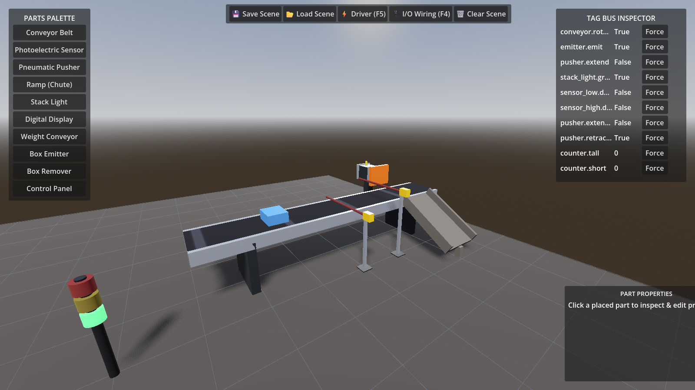

# FactoryForge

*A free, open 3D factory simulator for learning PLC programming.*

> **Status: active development.** Tag bus, drivers, Godot 4.7/C# engine with 3D rendering and Jolt physics are complete and tested end-to-end against a real S7-1500 (100.0% split verified on SCL v0.4). See the [roadmap](docs/ROADMAP.md). `factoryforge` is a
> working name.

Write ladder in TIA Portal, run it in S7-PLCSIM Advanced, and watch it drive a
factory. Or use OpenPLC over Modbus and pay nothing at all. No account, no
per-seat cost.



*The sorting scene driven live over the tag bus: a tall box just emitted, a
short box breaking the low sensor, and the pusher extended at the diverter.*

## Why

[Factory I/O](https://factoryio.com) is the best tool of its kind — and it is
stagnant, closed to custom parts, and €278/year. Nothing free comes close on
looks or ease of use. See the [PRD](docs/PRD.md) for the full argument.

## Architecture

```
┌────────────────────────────┐          ┌──────────────────────────┐
│  SIM ENGINE (Godot 4.7/C#) │          │  DRIVER SIDECAR (Python) │
│                            │          │                          │
│  3D render + Jolt physics  │  tag bus │  asyncua      (OPC UA)   │
│  scene editor / voxel grid │ ◄──────► │  pythonnet    (PLCSIM)   │
│  part behaviours           │    WS    │  python-snap7 (S7)       │
│  tag registry (authority)  │   JSON   │  built-in     (Modbus)   │
└────────────────────────────┘          └──────────────────────────┘
```

The split means you can add a **driver in Python** without touching the 3D
engine, or a **part in Godot** without touching Python. The
[tag bus protocol](docs/tag-bus.md) is the contract between them.

## What works today

- Tag bus: typed tags, forcing, epoch-guarded scene reloads, delta-only updates
- Headless & 3D "sorting by height" scene with **Jolt 3D physics**
- **Godot 4.7 C# engine**: 3D rendering view, Orbit camera & Free-Look fly camera (`'C'` key toggle), integer voxel grid floor overlay (`VoxelGrid.cs`)
- **3D Scene Editor Suite**: Interactive placement on VoxelGrid ('R' rotate, Left-Click place, Del remove), Parts Palette UI, Live Tag Bus Inspector & Forcing UI, Save/Load JSON scene format, Live Part Property Inspector, 3D Selection Outline Gizmo
- **8-Part Library** (`engine/src/Parts/`): Surface-velocity conveyor belt, rigid body boxes, RayCast3D photoelectric sensors, pneumatic pusher, inclined ramp (`Chute.cs`), 3-stage stack light (`StackLight.cs`), emitter, remover, control panel
- **OPC UA client** — connects to a PLC's server. **Verified end-to-end against a
  real S7-1500** (CPU 1511-1 PN via PLCSIM Advanced): **100.0% perfect split (99 tall / 99 short)** with SCL v0.4.
- **OPC UA server** — exposes the scene at `ns=2;s=<tag_id>`, so Node-RED,
  Ignition or any SCADA can drive it. Node-RED then bridges to MQTT, HTTP or a
  dashboard with no code from us.
- Modbus TCP server driver, so OpenPLC or any master can drive it now
- Mock driver for tests
- **Node-RED flow** that replaces the PLC entirely —
  `examples/nodered/factoryforge-flow.json`
- **Godot 4.7 / C# engine** with the tag bus ported to C#. Runs headless; the
  unchanged Python sidecar drives it (`python tools/drive_engine.py`).
- 38 passing tests, including a real pymodbus master and a real OPC UA client
  driving the simulation. **CI needs no Siemens software and no GPU.**

## Try it

```bash
pip install -e "sidecar[dev,opcua]"
python -m pytest
```

The test suite is currently the best demonstration: `tests/test_sorting.py`
runs a scripted control program that sorts boxes by height, and
`tests/test_modbus.py` drives the same scene from a real Modbus master.

## Documentation

| Document | What it covers |
|---|---|
| **[AGENTS.md](AGENTS.md)** | **Start here.** Paths, commands, hard-won gotchas, next steps |
| [PRD](docs/PRD.md) | Problem, users, goals, non-goals, success criteria |
| [Plan](docs/PLAN.md) | Architecture, design decisions, current state |
| [Roadmap](docs/ROADMAP.md) | Milestones and sequencing |
| [Session notes](docs/SESSION-NOTES.md) | What happened and why — the reasoning behind decisions |
| [Tag bus](docs/tag-bus.md) | The protocol between engine and sidecar |
| [TIA Portal setup](examples/tia/README.md) | Wiring a real S7-1500 to the simulator |

## Contributing

Too early for outside contributions — the interfaces are still moving. Once the
Godot engine lands (M2), adding parts and drivers will be the main way to help,
and both paths are designed to be approachable.

## Licence

MIT or Apache-2.0, to be decided before first release. Removing the price
barrier is the whole point, so it will be permissive.
